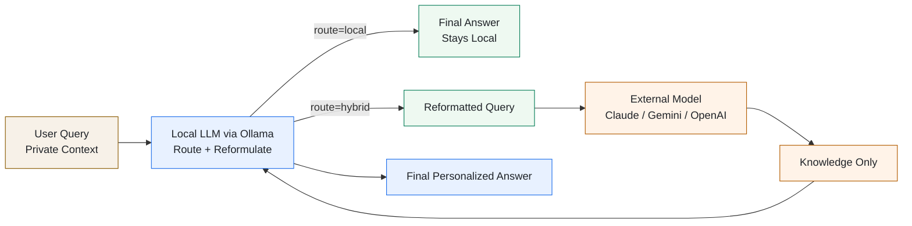

# Zipsa

**A local-first privacy gateway for OpenAI-compatible apps and OpenClaw workflows.**


> [!WARNING]
> Zipsa is experimental software. Routing behavior, prompts, APIs, and configuration may change without notice as the privacy architecture is validated.
> Use it for evaluation and iteration, not as a stable production release.

Zipsa sits between your application and external LLMs. It decides when a request can stay fully local, when external knowledge is actually needed, and how to rewrite the request so private context does not leave your environment.

**Works especially well as a privacy front-door for OpenClaw** via Zipsa's OpenAI-compatible endpoint.

- New here? Start with [How It Works](#how-it-works)
- Using OpenClaw? Jump to [OpenClaw Integration Guide](#openclaw-integration-guide)
- Want to try it quickly? See [Getting Started](#-getting-started)

Cloud AI models are powerful — but sending patient records, employee data, or business documents to an external API creates real privacy risks.

Zipsa solves this with a local-first approach: a local LLM (Ollama) evaluates every request and decides whether external knowledge is even needed. Simple queries, personal questions, and anything identity-bound are answered **entirely locally** — nothing leaves your environment.

When external knowledge would genuinely help, the local LLM **semantically reformulates** the query into a fully depersonalized version before anything is sent out. The cloud model answers only the sanitized version; the local model then applies that knowledge back to your actual context to produce the final answer.

It also exposes an **OpenAI-compatible API (`/v1/chat/completions`)** so it works as a drop-in replacement in any tool that supports OpenAI (Chatbox, AnythingLLM, etc.).



## How It Works

```text
User query (original, with private context)
  │
  ├─ Stage 1: Local LLM reformulates + routes
  │     Rewrites query into a depersonalized knowledge request
  │     (names → categories, institutions → types, events → descriptions)
  │     Decides: route="hybrid" (external needed) or route="local" (not needed)
  │
  ├─ Stage 2: Parallel inference  [hybrid only]
  │     Local LLM  ← raw_history + original query   (full context, decision-maker)
  │     External LLM ← sanitized_history + reformulated query  (no PII, ever)
  │
  └─ Stage 3: Local LLM synthesizes  [hybrid only]
        Original context + external knowledge → final personalized answer
```

**Reformulation example:**

| | Query |
| --- | --- |
| User sends | *"Jane Smith (DOB 1985-04-12, SSN 123-45-6789) is a senior ER physician at City General. Her HbA1c has worsened 7.8→8.4% over 6 months on metformin 2000mg + sitagliptin 100mg (eGFR 62). What are the treatment escalation options?"* |
| External sees | *"A healthcare professional (physician) in their late 30s with T2DM. HbA1c worsening 7.8→8.4% over 6 months. Current regimen: metformin 2000mg + DPP-4i (sitagliptin 100mg), eGFR 62. Rank the top escalation strategies with expected HbA1c reduction, renal dosing requirements, and monitoring needs."* |
| Local decides | Applies the ranked clinical analysis to Jane's actual profile → final answer |

## Multi-Turn Privacy

For multi-turn conversations, Zipsa maintains **two parallel histories per session**:

```text
Session state
├── raw_history        (local LLM only — never sent externally)
│   ├── Turn 1 user:  "Jane Smith (SSN 123-45-6789), HbA1c 8.4%..."
│   ├── Turn 1 asst:  "Consider GLP-1 agonist..."
│   └── Turn 2 user:  "Her eGFR dropped to 45, what now?"
│
└── sanitized_history  (sent to external provider)
    ├── Turn 1 user:  "T2DM patient, late 50s. HbA1c 8.4%..."
    ├── Turn 1 asst:  "Consider GLP-1 agonist..."
    └── Turn 2 user:  (← reformulated from current raw turn)
```

On each new turn, the reformulator receives the **sanitized history as context** (so it understands the ongoing conversation without re-exposing prior PII) and reformulates only the **current raw message**. The external provider receives a proper messages array — sanitized history plus the new reformulated turn — never the raw originals.

## ✨ Key Features

- **Local LLM as privacy shield**: a local model always intermediates between your data and any external provider — raw queries never leave your environment.
- **Semantic reformulation**: full sentence rewriting that abstracts context (occupation → category, institution → type, event → description), not just PII token replacement.
- **Autonomous routing**: the local LLM decides per-turn whether external knowledge is needed, so simple or identity-bound queries stay entirely local.
- **Dual-history sessions**: raw history stays local; only the sanitized history is passed to the external provider as a proper multi-turn messages array.
- **Local is the decision-maker**: the external model is a knowledge provider only — the local model synthesizes the final answer with full original context.
- **OpenAI-compatible API**: drop-in replacement endpoint.
- **Multi-provider support**: Claude, Gemini, or OpenAI as the external model.

## 🚀 Getting Started

### Prerequisites

- Docker and Docker Compose
- Ollama installed and running locally (`http://localhost:11434`)
- A local model pulled in Ollama that matches `LOCAL_MODEL` (default: `qwen3.5`)
- An API key for your chosen external provider

### Docker Setup

1. **Clone the repository**

   ```bash
   git clone https://github.com/sulgik/zipsa.git
   cd zipsa
   ```

2. **Configure**

   ```bash
   cp .env.example .env
   ```

   Edit `.env`:

   ```env
   LOCAL_MODEL=qwen3.5
   EXTERNAL_PROVIDER=claude
   ANTHROPIC_API_KEY=your-key
   ```

   Ensure the local Ollama model exists before starting:

   ```bash
   ollama pull qwen3.5
   ```

3. **Start**

   ```bash
   docker-compose up -d
   ```

   > On first run, Ollama automatically downloads the local model. This may take a few minutes.

4. **Health check**

   ```bash
   curl http://localhost:8000/health
   ```

### Local (Native) Setup

1. Install [Ollama](https://ollama.com/), start it with `ollama serve`, and pull a model: `ollama pull qwen3.5`
2. Install dependencies (Python 3.11+):

   ```bash
   pip install -r requirements.txt
   ```

3. Run:

   ```bash
   uvicorn main:app --host 0.0.0.0 --port 8000
   ```

## 🔌 API Usage

### OpenAI-Compatible Endpoint (Recommended)

- **Base URL:** `http://localhost:8000/v1`
- **API Key:** any string (or Bearer token from `.env`)
- **Model:** `zipsa`

```python
from openai import OpenAI

client = OpenAI(base_url="http://localhost:8000/v1", api_key="zipsa-key")

response = client.chat.completions.create(
    model="zipsa",
    messages=[{"role": "user", "content": "Jane Smith (SSN 123-45-6789) needs help with her diabetes treatment."}]
)
print(response.choices[0].message.content)
```

For **multi-turn sessions**, pass a `session_id` to enable dual-history tracking:

```python
response = client.chat.completions.create(
    model="zipsa",
    messages=[{"role": "user", "content": "Her eGFR dropped to 45, what now?"}],
    extra_body={"session_id": "session-abc123"}
)
```

> A safety footer (`🔒 Zipsa: claude 🛡️sanitized`) is appended to indicate the external provider used.

### Native `/relay` Endpoint

```bash
curl -X POST http://localhost:8000/relay \
  -H "Content-Type: application/json" \
  -d '{"user_query": "Jane Smith (SSN 123-45-6789) needs help with her diabetes treatment.", "session_id": "session-abc123"}'
```

Request fields:

| Field | Description |
| ----- | ----------- |
| `user_query` | The user's original query (required) |
| `session_id` | Session identifier for multi-turn dual-history tracking (optional) |

## OpenClaw Integration Guide

If you want to use Zipsa as the privacy front-door for OpenClaw, connect OpenClaw to Zipsa's OpenAI-compatible endpoint instead of sending raw prompts directly to an external model.

### Architecture

```text
OpenClaw
  -> Zipsa (/v1/chat/completions)
  -> local reformulation + routing
  -> external knowledge provider only when needed
  -> final answer returned back to OpenClaw
```

### Step 1: Start Zipsa

Make sure Zipsa is running locally:

```bash
docker-compose up -d
curl http://localhost:8000/health
```

### Step 2: Point OpenClaw to Zipsa

In any OpenClaw component that supports an OpenAI-style base URL, use:

```env
OPENAI_BASE_URL=http://localhost:8000/v1
OPENAI_API_KEY=zipsa-key
OPENAI_MODEL=zipsa
```

If the integration field is named differently, the values still map the same way:

- base URL: `http://localhost:8000/v1`
- API key: any non-empty string, or the Bearer token configured in Zipsa
- model: `zipsa`

### Step 3: Send the original query normally

OpenClaw should send the full original prompt. Zipsa handles the privacy-preserving reformulation and routing internally.

```python
from openai import OpenAI

client = OpenAI(
    base_url="http://localhost:8000/v1",
    api_key="zipsa-key",
)

response = client.chat.completions.create(
    model="zipsa",
    messages=[
        {
            "role": "user",
            "content": "Jane Smith (SSN 123-45-6789) needs help with her diabetes treatment."
        }
    ],
)
```

### Step 4: Preserve session continuity

For multi-turn OpenClaw workflows, pass a stable `session_id` so Zipsa can maintain raw and reformulated histories separately:

```python
response = client.chat.completions.create(
    model="zipsa",
    messages=[{"role": "user", "content": "Her eGFR dropped to 45, what now?"}],
    extra_body={"session_id": "openclaw-case-001"},
)
```

### When this is useful

- You want OpenClaw to keep using an OpenAI-style client without code changes in the rest of the pipeline.
- You want patient or case-specific prompts to stay local unless external knowledge is actually needed.
- You want Zipsa to act as a privacy boundary between OpenClaw and Claude, Gemini, or OpenAI.

## ⚙️ Configuration

| Variable | Default | Description |
| -------- | ------- | ----------- |
| `LOCAL_MODEL` | `qwen3.5` | Ollama model for reformulation and synthesis |
| `LOCAL_HOST` | `http://localhost:11434` | Ollama server URL |
| `EXTERNAL_PROVIDER` | `claude` | External knowledge provider: `claude`, `gemini`, `openai` |
| `ANTHROPIC_API_KEY` | — | Required if `EXTERNAL_PROVIDER=claude` |
| `GEMINI_API_KEY` | — | Required if `EXTERNAL_PROVIDER=gemini` |
| `OPENAI_API_KEY` | — | Required if `EXTERNAL_PROVIDER=openai` |
| `DEMO_MODE` | `true` | Skip Bearer token auth when `true` |

## 📄 License

This project is licensed under the **Business Source License 1.1 (BSL 1.1)**.

- **Non-commercial / non-production use** (personal, research, evaluation, open-source projects without revenue) is freely permitted.
- **Commercial / production use** requires a separate commercial license. Contact: [sulgik@gmail.com](mailto:sulgik@gmail.com)
- **Change Date: 2029-03-12** — on this date the license automatically converts to [Apache License 2.0](https://www.apache.org/licenses/LICENSE-2.0), and all restrictions are lifted.

See the [LICENSE](LICENSE) file for full terms.
