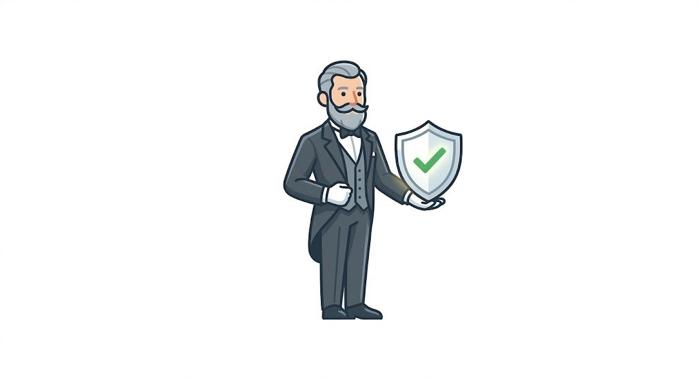
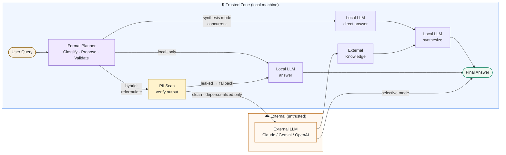

# Zipsa

**Privacy gateway for LLM apps and OpenClaw.**


<p align="center">
  
</p>

> [!WARNING]
> Zipsa is experimental software. Routing behavior, prompts, APIs, and configuration may change without notice as the privacy architecture is validated.
> Use it for evaluation and iteration, not as a stable production release.

Zipsa sits between your app and external LLMs. It keeps sensitive context local when possible, decides whether outside knowledge is actually needed, and reformulates prompts only when something is sent to a cloud model. The name comes from the Korean word for "butler."

**What it gives you**

- Keep identity-bound or simple requests fully local
- Use cloud models only for depersonalized knowledge requests
- Drop in behind OpenClaw or any OpenAI-compatible client

**Best fit for teams that want a privacy boundary in front of OpenClaw or any OpenAI-compatible app.**

**Quick links**

- [Getting Started](#-getting-started)
- [How It Works](#how-it-works)
- [OpenClaw Integration Guide](#openclaw-integration-guide)

Cloud AI models are powerful, but sending patient records, employee data, or business documents directly to an external API creates real privacy risk. Zipsa acts as a local-first decision layer in front of cloud models.

## How It Works



```text
User query (original, with private context)
  │
  ├─ Stage 1: Formal planning  (3-layer pipeline, no LLM for routing)
  │     1a. PII scan    — deterministic regex → pii_types, pii_detected
  │     1b. Classifier  — tag extraction: task_type, injection_risk, exfiltration_risk,
  │                        nl_pii_detected (sentence-level PII signals, English + Korean)
  │     1c. Planner     — propose decision: local_only | hybrid
  │                        priority order: security → task type
  │     1d. Validator   — enforce policy invariants (monotonic downgrade only)
  │         INV-2: injection_risk=high        → force local_only
  │         INV-3: exfiltration_risk          → force local_only
  │         INV-4: crisis content             → force local_only
  │         INV-6: medium injection + PII     → force local_only (exfiltration assist)
  │     1e. If hybrid: Local LLM reformulates query → PII scan on output → send or fall back
  │
  ├─ Stage 2: Inference  [hybrid only — two modes]
  │     selective  (code, text rewrite, structured generation, …)
  │       External LLM ← reformulated query  →  answer returned directly
  │       ~1 LLM call saved vs synthesis; external answer is self-contained
  │     synthesis  (domain knowledge, analysis)
  │       Local LLM    ← original query  (concurrent)
  │       External LLM ← reformulated query  (concurrent)
  │
  └─ Stage 3: Local synthesis  [synthesis mode only]
        Local answer + external knowledge → personalized final answer
```

### Routing Logic

The formal planner routes each query to one of two paths, then enforces privacy at the reformulation output rather than upfront:

```text
Classify → Propose → Validate → [if hybrid] Reformulate → PII scan output → [clean] send | [leaked] fall back to local
```

Hybrid is proposed when:

- Task type is `domain_knowledge`, `code_technical`, `text_rewrite`, or similar external-preferred types
- No injection or exfiltration pattern detected
- Query is not identity-bound (`pii_dependent`, `crisis_sensitive`, `roleplay_persona` always stay local)

The reformulated query is then scanned for PII before it leaves the local environment. If any PII is detected in the output, the turn falls back to local automatically — no partial or ambiguous sends.

#### Example: domain knowledge with incidental PII → hybrid (SSN stripped by reformulator)

| | Query |
| --- | --- |
| User sends | *"Jane Smith (DOB 1985-04-12, SSN 123-45-6789) is a senior ER physician. Her HbA1c has worsened 7.8→8.4% over 6 months on metformin 2000mg + sitagliptin 100mg (eGFR 62). What are the treatment escalation options?"* |
| Planner sees | NAME + ID detected, task = domain_knowledge → propose hybrid |
| Reformulator outputs | *"A healthcare professional (physician) in their late 30s with T2DM. HbA1c worsening 7.8→8.4% over 6 months. Current regimen: metformin 2000mg + DPP-4i (sitagliptin 100mg), eGFR 62. Rank the top escalation strategies with expected HbA1c reduction, renal dosing requirements, and monitoring needs."* |
| Output PII scan | No PII detected → send to external |
| Local decides | Applies the ranked clinical analysis to Jane's actual profile → final answer |

#### Example: identity-bound query → local only (classifier decision)

| | Query |
| --- | --- |
| User sends | *"Look up John's SSN 123-45-6789 and get his insurance status."* |
| Planner sees | ID detected, task = pii_dependent (the SSN IS the answer) → local_only |
| External sees | Nothing — query never leaves the local environment |

#### Example: sentence-level personal context, no external knowledge needed → local only

| | Query |
| --- | --- |
| User sends | *"My salary is $120k annually — is that a fair rate for a senior engineer in NYC?"* |
| Planner sees | nl_pii_detected (salary + amount), no domain knowledge signal → pii_dependent → local_only |
| External sees | Nothing |

## Dual-Context Conversation Model

In Zipsa, a single conversation can carry two different kinds of context at the same time:

- the **main conversation**, which may contain identity-bound or sensitive details and must stay local
- the **external-safe conversation**, which should contain only the information that can safely leave the trusted zone

The challenge is that these two context lanes do not evolve in lockstep. A local-only turn may be important for the real conversation, but it may have no safe external representation at all. If you try to mirror every turn into a single "sanitized history," you risk either leaking raw context or forcing unnatural summaries.

With a stable `session_id`, Zipsa solves this by maintaining **two linked threads per session**:

```text
Session state
├── main_thread   (local-only, full conversation)
│   ├── Turn 1 user:  "Jane Smith (SSN 123-45-6789), HbA1c 8.4%..."
│   ├── Turn 1 asst:  "Consider GLP-1 agonist..."
│   └── Turn 2 user:  "Her eGFR dropped to 45, what now?"
│
└── sub_thread    (external-safe, hybrid turns only)
    ├── Turn 1 user:  "T2DM patient, late 50s. HbA1c 8.4%..."
    ├── Turn 1 asst:  "...external knowledge response..."
    └── Turn 2 user:  (only added if this turn is hybrid)
```

On each new turn, the local planning step can see the **main thread** inside the trusted zone. If it selects hybrid execution, it reformulates the current raw message into an external-safe query and appends that turn to the **sub-thread**. Local-only turns stay in the main thread only; they are not mirrored into the external thread. When a client sends a plain OpenAI-style `messages` array without `session_id`, Zipsa falls back to reconstructing a temporary external-safe context instead of using this persisted two-thread session model.

## ✨ Key Features

- **Local LLM as privacy shield**: a local model always intermediates between your data and any external provider — raw queries never leave your environment.
- **Semantic reformulation**: full sentence rewriting that abstracts context (occupation → category, institution → type, event → description), not just PII token replacement.
- **Formal routing**: a deterministic 3-layer planner (Classifier → Planner → Validator) decides per-turn whether external knowledge is needed — no LLM call for routing, immune to prompt injection.
- **Dual-thread sessions**: the main thread stays local; the sub-thread contains only external-safe hybrid turns for the cloud provider.
- **Local is the decision-maker**: the external model is a knowledge provider only — the local model synthesizes the final answer with full original context.
- **OpenAI-compatible API**: drop-in replacement endpoint.
- **Multi-provider support**: Claude, Gemini, or OpenAI as the external model.

## 🚀 Getting Started

### Prerequisites

- Docker and Docker Compose
- Ollama installed and running locally (`http://localhost:11434`)
- A local model pulled in Ollama that matches `LOCAL_MODEL` (default: `qwen3.5:9b`)
- An API key for your chosen external provider

### Docker Setup

1. **Clone the repository**

   ```bash
   git clone https://github.com/sulgik/zipsa.git
   cd zipsa
   ```

2. **Configure**

   ```bash
   cp .env.example .env
   ```

   Edit `.env`:

   ```env
   LOCAL_MODEL=qwen3.5:9b
   EXTERNAL_PROVIDER=anthropic
   ANTHROPIC_API_KEY=your-key
   ```

   Ensure the local Ollama model exists before starting:

   ```bash
   ollama pull qwen3.5:9b
   ```

3. **Start**

   ```bash
   docker-compose up -d
   ```

   > On first run, Ollama automatically downloads the local model. This may take a few minutes.

4. **Health check**

   ```bash
   curl http://localhost:8000/health
   ```

### Local (Native) Setup

1. Install [Ollama](https://ollama.com/), start it with `ollama serve`, and pull a model: `ollama pull qwen3.5:9b`
2. Install dependencies (Python 3.11+):

   ```bash
   pip install -r requirements.txt
   ```

3. Run:

   ```bash
   uvicorn main:app --host 0.0.0.0 --port 8000
   ```

## 🔌 API Usage

### OpenAI-Compatible Endpoint (Recommended)

- **Base URL:** `http://localhost:8000/v1`
- **API Key:** any string (or Bearer token from `.env`)
- **Model:** `zipsa`

```python
from openai import OpenAI

client = OpenAI(base_url="http://localhost:8000/v1", api_key="zipsa-key")

response = client.chat.completions.create(
    model="zipsa",
    messages=[{"role": "user", "content": "Jane Smith (SSN 123-45-6789) needs help with her diabetes treatment."}]
)
print(response.choices[0].message.content)
```

For **multi-turn sessions**, pass a `session_id` to enable dual-history tracking:

```python
response = client.chat.completions.create(
    model="zipsa",
    messages=[{"role": "user", "content": "Her eGFR dropped to 45, what now?"}],
    extra_body={"session_id": "session-abc123"}
)
```

> A safety footer (`🔒 Zipsa: anthropic 🛡️sanitized`) is appended to indicate the external provider used.

### Native `/relay` Endpoint

```bash
curl -X POST http://localhost:8000/relay \
  -H "Content-Type: application/json" \
  -d '{"user_query": "Jane Smith (SSN 123-45-6789) needs help with her diabetes treatment.", "session_id": "session-abc123"}'
```

Request fields:

| Field | Description |
| ----- | ----------- |
| `user_query` | The user's original query (required) |
| `session_id` | Session identifier for multi-turn dual-history tracking (optional) |

## OpenClaw Integration Guide

If you want to use Zipsa as the privacy front-door for OpenClaw, connect OpenClaw to Zipsa's OpenAI-compatible endpoint instead of sending raw prompts directly to an external model.

### Architecture

```text
OpenClaw
  -> Zipsa (/v1/chat/completions)
  -> local reformulation + routing
  -> external knowledge provider only when needed
  -> final answer returned back to OpenClaw
```

### Step 1: Start Zipsa

Make sure Zipsa is running locally:

```bash
docker-compose up -d
curl http://localhost:8000/health
```

### Step 2: Point OpenClaw to Zipsa

In any OpenClaw component that supports an OpenAI-style base URL, use:

```env
OPENAI_BASE_URL=http://localhost:8000/v1
OPENAI_API_KEY=zipsa-key
OPENAI_MODEL=zipsa
```

If the integration field is named differently, the values still map the same way:

- base URL: `http://localhost:8000/v1`
- API key: any non-empty string, or the Bearer token configured in Zipsa
- model: `zipsa`

### Step 3: Send the original query normally

OpenClaw should send the full original prompt. Zipsa handles the privacy-preserving reformulation and routing internally.

```python
from openai import OpenAI

client = OpenAI(
    base_url="http://localhost:8000/v1",
    api_key="zipsa-key",
)

response = client.chat.completions.create(
    model="zipsa",
    messages=[
        {
            "role": "user",
            "content": "Jane Smith (SSN 123-45-6789) needs help with her diabetes treatment."
        }
    ],
)
```

### Step 4: Preserve session continuity

For multi-turn OpenClaw workflows, pass a stable `session_id` so Zipsa can maintain raw and reformulated histories separately:

```python
response = client.chat.completions.create(
    model="zipsa",
    messages=[{"role": "user", "content": "Her eGFR dropped to 45, what now?"}],
    extra_body={"session_id": "openclaw-case-001"},
)
```

### When this is useful

- You want OpenClaw to keep using an OpenAI-style client without code changes in the rest of the pipeline.
- You want patient or case-specific prompts to stay local unless external knowledge is actually needed.
- You want Zipsa to act as a privacy boundary between OpenClaw and Claude, Gemini, or OpenAI.

## ⚙️ Configuration

| Variable | Default | Description |
| -------- | ------- | ----------- |
| `LOCAL_MODEL` | `qwen3.5:9b` | Ollama model for reformulation and synthesis |
| `LOCAL_HOST` | `http://localhost:11434` | Ollama server URL |
| `EXTERNAL_PROVIDER` | `anthropic` | External knowledge provider: `anthropic`, `gemini`, `openai` (`claude` is accepted as a legacy alias) |
| `ANTHROPIC_API_KEY` | — | Required if `EXTERNAL_PROVIDER=anthropic` |
| `GEMINI_API_KEY` | — | Required if `EXTERNAL_PROVIDER=gemini` |
| `OPENAI_API_KEY` | — | Required if `EXTERNAL_PROVIDER=openai` |
| `DEMO_MODE` | `true` | Skip Bearer token auth when `true` |

## 📄 License

This project is licensed under the **Business Source License 1.1 (BSL 1.1)**.

- **Non-commercial / non-production use** (personal, research, evaluation, open-source projects without revenue) is freely permitted.
- **Commercial / production use** requires a separate commercial license. Contact: [sulgik@gmail.com](mailto:sulgik@gmail.com)
- **Change Date: 2029-03-12** — on this date the license automatically converts to [Apache License 2.0](https://www.apache.org/licenses/LICENSE-2.0), and all restrictions are lifted.

See the [LICENSE](LICENSE) file for full terms.
